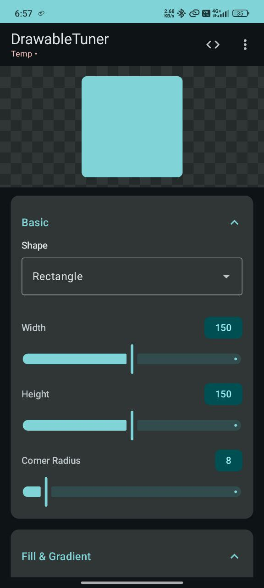
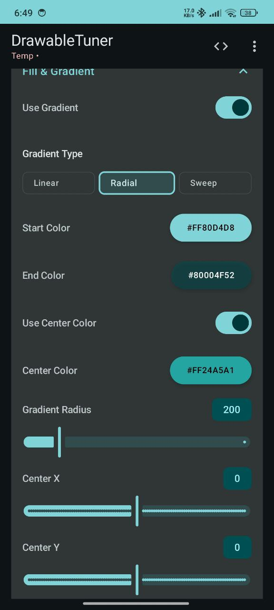
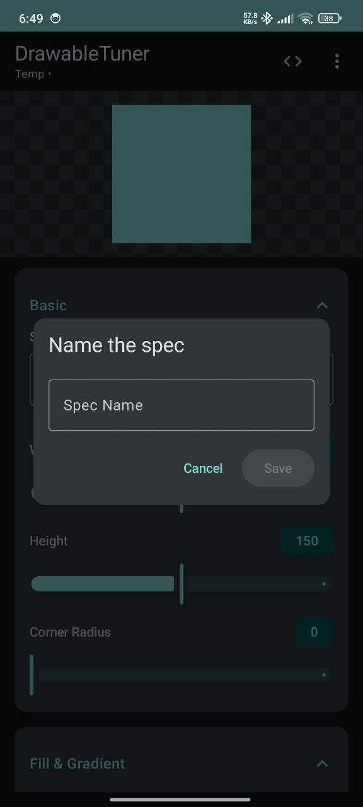
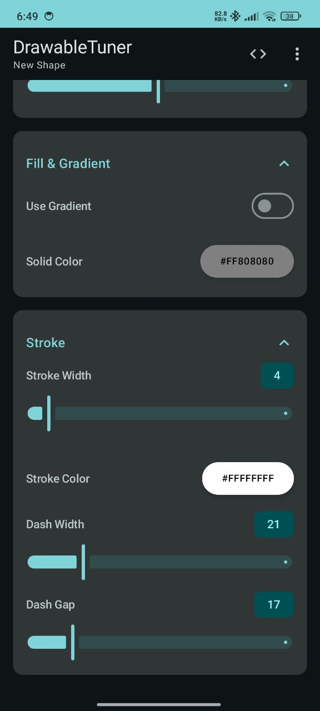
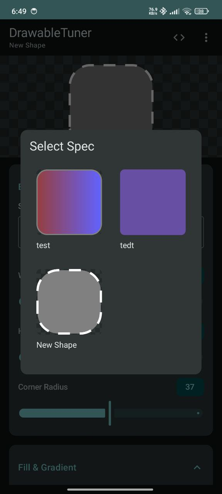
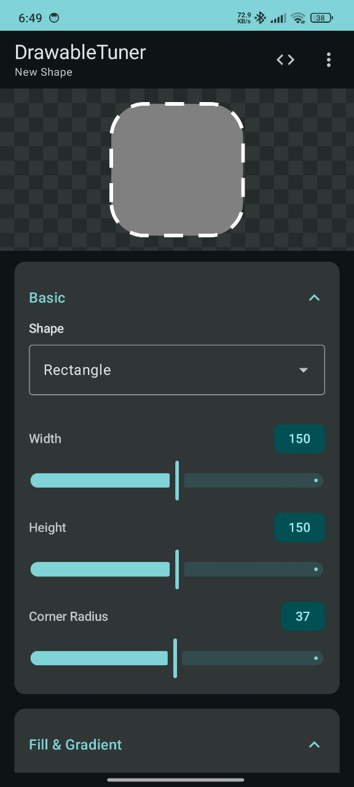
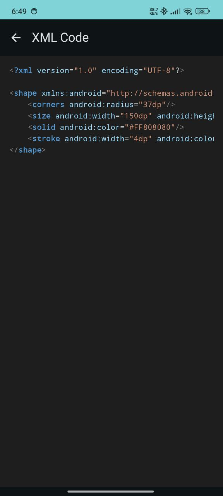

# DrawableTuner
[](https://kotlinlang.org)
[](https://developer.android.com/jetpack/compose)
[](https://github.com/ISEKHON/DrawableTuner/releases)
[](https://github.com/ISEKHON/DrawableTuner/releases)
[](https://github.com/ISEKHON/DrawableTuner/commits/)
[](https://github.com/ISEKHON/DrawableTuner)

A modern Android app for creating and designing gradient drawables with a beautiful Material 3 UI. Create complex shapes, gradients, and export them as XML code ready to use in your Android projects.

## Screenshots

<p align="center">
  
  
  
</p>

<p align="center">
  
  
  
</p>

<p align="center">
  
</p>

## Features

### 🎨 Shape Design
- **Multiple Shape Types**: Rectangle, Oval, Line, and Ring
- **Customizable Dimensions**: Width and height controls (50-250dp)
- **Corner Radius**: Adjustable rounded corners for rectangles
- **Real-time Preview**: See your changes instantly with a centered preview

### 🌈 Gradient Controls
- **Gradient Types**: Linear, Radial, and Sweep gradients
- **Color Customization**: Start, center, and end color pickers
- **Advanced Settings**:
  - Angle control for linear gradients (0-360°)
  - Gradient radius for radial gradients
  - Center X/Y positioning for radial and sweep gradients
- **Solid Colors**: Option to use solid fills instead of gradients

### 🖌️ Stroke & Border
- **Stroke Width**: Adjustable border thickness (0-50dp)
- **Stroke Color**: Custom border colors
- **Dashed Strokes**: Create dashed borders with customizable dash width and gap

### ✨ Modern UI/UX
- **Material 3 Design**: Beautiful, modern interface with spring animations
- **Collapsible Sections**: Organized property groups for better navigation
- **Interactive Controls**: 
  - Smooth slider animations with real-time value badges
  - Scale animations on chip selection
  - Elevation changes on card interaction
- **Smart Preview**:
  - Collapsible preview that shrinks to top-left corner on scroll
  - Animated transitions with spring physics
  - Checkerboard background for transparency visualization

### 💾 Export & Code
- **XML Export**: Generate ready-to-use XML drawable code
- **Code Viewer**: Custom syntax-highlighted code display with dark/light theme support
- **Copy & Save**: Easily copy or save your drawable specifications

## Technology Stack

- **Language**: Kotlin 2.3.0
- **UI Framework**: Jetpack Compose with Material 3
- **Architecture**: MVVM with ViewModel and Repository pattern
- **Persistence**: JSON file storage with Kotlin Serialization
- **Code Highlighting**: Custom XML syntax highlighter
- **Build System**: Gradle with Kotlin DSL
- **Min SDK**: 26 (Android 8.0)
- **Target SDK**: 35 (Android 15)

## Dependencies

```kotlin
- Jetpack Compose BOM 2026.01.01
- Material 3 Compose
- Material Icons Extended
- Kotlin Serialization
- Kotlin Reflection
- dom4j (XML processing)
- Core Library Desugaring
```

## Installation

1. Clone the repository:
```bash
git clone https://github.com/ISEKHON/DrawableTuner.git
```

2. Open the project in Android Studio

3. Sync Gradle and build the project

4. Run on your device or emulator (requires Android 8.0+)

## Usage

1. **Select Shape**: Choose from Rectangle, Oval, Line, or Ring
2. **Configure Size**: Adjust width and height using sliders
3. **Add Gradient**: Toggle gradient mode and select type
4. **Customize Colors**: Pick your desired colors using the color pickers
5. **Fine-tune**: Adjust angle, radius, center position, and other properties
6. **Add Stroke**: Configure border width, color, and dash patterns
7. **Preview**: Watch your drawable update in real-time
8. **Export**: View and copy the generated XML code

## Contributing

Contributions are welcome! Please feel free to submit a Pull Request.

## License

This project is open source and available under the [MIT License](LICENSE).

## Author

**Jagdeep Singh**
- GitHub: [@ISEKHON](https://github.com/ISEKHON)

## Acknowledgments

- Built with [Jetpack Compose](https://developer.android.com/jetpack/compose)
- XML processing with [dom4j](https://dom4j.github.io/)
- Inspired by the need for a modern drawable design tool
